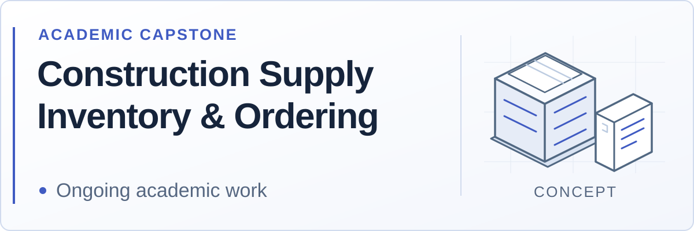
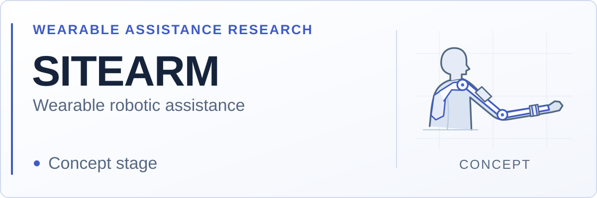
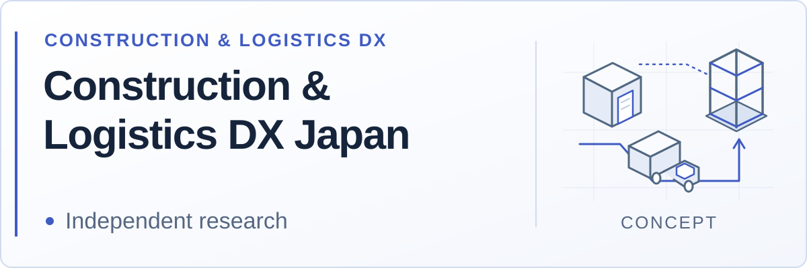
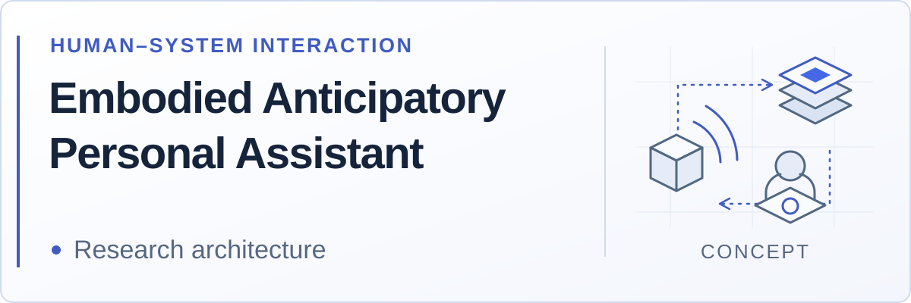
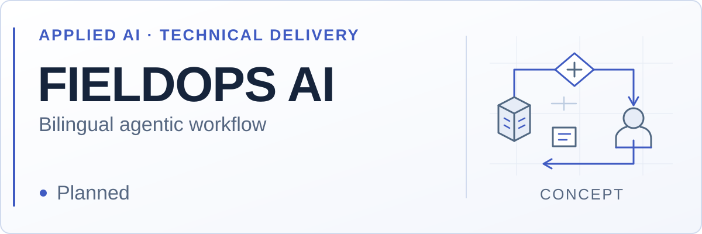
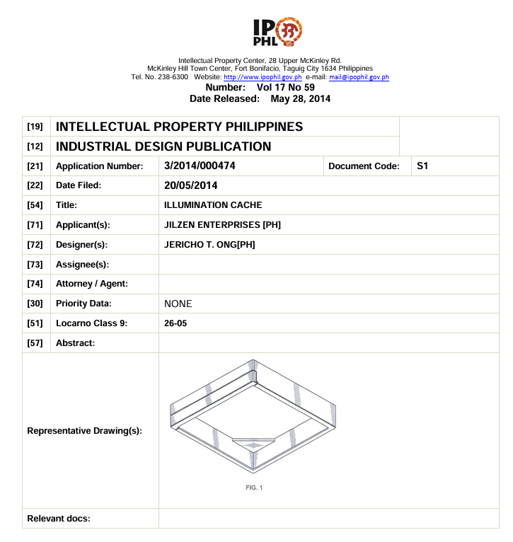

<picture>
  <source media="(prefers-color-scheme: dark) and (max-width: 600px)" srcset="assets/brand/header-mobile-dark.svg">
  <source media="(prefers-color-scheme: light) and (max-width: 600px)" srcset="assets/brand/header-mobile-light.svg">
  <source media="(prefers-color-scheme: dark)" srcset="assets/brand/header-dark.svg">
  <source media="(prefers-color-scheme: light)" srcset="assets/brand/header-light.svg">
  
</picture>

<strong>Jericho Ong · ジェリコ・オング</strong>

  <strong>IT &amp; Digital Systems · Construction &amp; Logistics DX</strong> 
  Independent researcher based in Japan · Approximately 13 years of construction project management 
  日本を拠点に、建設の実務経験をソフトウェア・データ・システム研究へ。

  <a href="https://github.com/aomori753/construction-logistics-dx-japan">Research / 研究</a> ·
  <a href="#projects">Projects / プロジェクト</a> ·
  <a href="#toolkit">Toolkit / 使用技術</a> ·
  <a href="#development">Development / 学習と資格目標</a> ·
  <a href="https://www.linkedin.com/in/jericho-o-52b9b434a/">Connect / お問い合わせ</a>

## Current direction / 現在の方向性

| Perspective | Focus |
| --- | --- |
| FIELD EXPERIENCE | Construction project management |
| DIGITAL SYSTEMS | Software, data and operational workflows |
| DX | Construction and logistics |
| INTELLIGENT SYSTEMS | Automation, Agentic AI and Physical AI exploration |

## Selected systems & research / プロジェクトと研究

<picture>
  <source media="(prefers-color-scheme: dark)" srcset="assets/project-cards/construction-supply-dark.svg">
  <source media="(prefers-color-scheme: light)" srcset="assets/project-cards/construction-supply-light.svg">
  
</picture>

### Construction Supply Inventory & Ordering

**Academic capstone / 卒業研究**

The capstone is part of my ongoing academic work.

Capstone brief / English

*A Web-Based Inventory and Ordering System for Construction Supply Businesses*

Connects construction-domain experience with information systems through inventory visibility and ordering workflows. The capstone is part of my ongoing academic work.

日本語 / Japanese

建設資材事業者向けのWeb在庫・発注管理システムを題材に、現場経験と情報システムを結ぶ卒業研究に取り組んでいます。

<picture>
  <source media="(prefers-color-scheme: dark)" srcset="assets/project-cards/sitearm-dark.svg">
  <source media="(prefers-color-scheme: light)" srcset="assets/project-cards/sitearm-light.svg">
  
</picture>

### SITEARM · Wearable robotic assistance

**Concept stage · Simulation-first research plan / コンセプト段階・シミュレーション中心の研究計画**

[Public numerical research](https://github.com/aomori753/sitearm-research) · Python · NumPy · Matplotlib · PyYAML

**Current evidence — public repository reviewed 25 September 2026:** The repository contains synthetic planar kinematics, workspace/path studies and static external wrist-load calculations. These are numerical research artifacts, not a physically validated wearable or demonstrated assistance. Physical assistance and ergonomic outcomes remain research tasks.

Research scope / English

> **Let the task define the assistance. / 作業に合わせて、支援を設計する。**

SITEARM investigates how a wearable upper-limb mechanism could support lifting, positioning and material handling in construction and logistics. The proposed system is defined around the worker, task, load, movement and operating environment.

日本語 / Japanese

SITEARMは、作業者、作業、荷重、動作、作業環境を出発点に、建設・物流での持ち上げ、位置決め、資材運搬を支援する上肢の装着機構を検討しています。2026年9月25日に確認した公開リポジトリには、合成条件による平面運動学、作業空間・経路の検討、手首に与えた外力の静的モーメント計算が含まれています。これらは数値研究の成果であり、実機の検証や支援性能の実証ではありません。実際の支援性能、人間工学的な効果は今後の研究課題です。

<strong>Concepts, methods and staged toolchain / 構想・研究手法・段階的な技術構成</strong>

Earlier design questions: S1, P1 and M1 are retained as prior working labels. The current public repository uses SA-01, SA-02 and SA-03; these questions do not imply validated mechanisms.

**Concept / 構想** · **Research question / 研究課題**

**S1 · Shoulder-Lift Assist**

How could upper-arm support share task loads while preserving useful movement? / 必要な腕の動きを確保しながら、上腕の支援で荷重をどう分担できるか。

**P1 · Precision-Hold Support**

How could forearm positioning support preserve deliberate movement and controlled release? / 前腕の位置保持と、意図した動作・解除をどう両立できるか。

**M1 · Modular Task-Assist Arm**

How could a common body interface accommodate task-specific modules? / 共通の身体接続部を異なる作業用モジュールにどう適合させられるか。

**Method:** Task → Human model → Wearable model → Kinematics → Workspace → Simulation → Results.

作業 → 人体モデル → 装着機構モデル → 運動学 → 作業空間 → シミュレーション → 結果の順で研究を進める計画です。

The proposed evaluation considers joint alignment, range of motion, workspace, body interfaces, load interaction, fit and human control. Findings should record assumptions, boundary conditions, uncertainty and untested cases.

**Stage / 段階** · **Selected direction / 技術方針**

**Initial numerical work / 初期の数値研究**

Python 3.12+, NumPy, SciPy, SymPy, Matplotlib; forward/inverse kinematics, joint limits and workspace sampling.

**Reproducibility / 再現性**

YAML inputs; JSON/CSV outputs; pytest, Ruff; Markdown, Mermaid, Git and GitHub.

**Geometry and inspection / 形状と確認**

Planned Blender and PyVista studies; mypy as interfaces stabilize.

**Advanced simulation / 高度なシミュレーション**

Planned NVIDIA Isaac Sim / Omniverse and OpenUSD work, following reproducible numerical baselines.

**Later learning research / 将来の学習研究**

Isaac Lab and Physical AI where a defined research question justifies them.

The public numerical study now generates a **Reality Gap Ledger** and a **Design Passport** linking modeled cases, assumptions, evaluation scope and supporting artifacts. These records make the research traceable; they do not establish field validity or device performance.

The initial scope focuses on numerical models; ROS 2, Gazebo, AI/ML, databases, Arduino and hardware control are outside that first stage. The portfolio's optional Three.js viewer presents concept geometry; camera movement does not establish simulated mechanical behavior.

関節軸の整合、可動域、作業空間、身体接続部、荷重の相互作用、装着性、人による操作を評価課題とします。仮定、境界条件、不確かさ、未検証の条件を記録し、数値計算の基礎から形状の検討、高度なシミュレーションへ段階的に進める計画です。

公開された数値研究では、Reality Gap LedgerとDesign Passportを生成し、モデル化した事例、仮定、評価範囲、根拠資料を追跡できるようにしています。これらの記録は現場での妥当性や装置性能を証明するものではありません。初期段階では数値モデルに集中し、実機の制御は対象に含めません。ポートフォリオの3D表示は概念形状の確認用です。

<picture>
  <source media="(prefers-color-scheme: dark)" srcset="assets/project-cards/construction-logistics-dx-dark.svg">
  <source media="(prefers-color-scheme: light)" srcset="assets/project-cards/construction-logistics-dx-light.svg">
  
</picture>

### [Construction & Logistics DX Japan](https://github.com/aomori753/construction-logistics-dx-japan)

**Independent research · Bilingual systems framework / 独立研究・日英のシステム設計フレームワーク**

**Evidence:** Public research documentation and conceptual architecture.

Research scope / English

Examines the construction site as a logistics node: connecting material availability, just-in-time delivery and workfront readiness. The research explores throughput constraints associated with Japan's “2024 Logistics Problem,” API coordination, event-driven information exchange, IoT and digital-twin concepts.

日本語 / Japanese

建設現場を物流ノードとして捉え、資材の供給状況、JIT搬入、作業着手条件を結び付ける研究です。「2024年物流問題」に関わる処理能力の制約、API連携、イベント駆動型の情報交換、IoT、デジタルツインの概念を検討しています。日英の研究文書と概念設計を公開しています。

<picture>
  <source media="(prefers-color-scheme: dark)" srcset="assets/project-cards/eapa-dark.svg">
  <source media="(prefers-color-scheme: light)" srcset="assets/project-cards/eapa-light.svg">
  
</picture>

### [Embodied Anticipatory Personal Assistant](https://github.com/aomori753/Embodied-Anticipatory-Personal-Assistant)

**Research architecture · Human–system interaction / 研究構想・人とシステムの協働**

**Evidence:** Public architecture and implementation guidelines.

Research scope / English

Investigates a perception–prediction–action architecture for assistance that responds to context and anticipates useful actions. The research connects environmental information, predictive world models and explicit human oversight.

日本語 / Japanese

周囲の状況を理解し、次に必要となる支援を予測する「知覚・予測・行動」のアーキテクチャを検討しています。環境情報、予測世界モデル、人による監督を結ぶ設計構想と実装指針を公開しています。

<strong>Further work / その他の取り組み</strong>

- **CyberGuard-Anywhere — personal cybersecurity architecture study.** Security protocols, risk awareness and security-management foundations informed by IPA study and Google cybersecurity learning. / セキュリティプロトコル、リスク認識、管理の基礎を扱う個人研究。IPAの学習とGoogleのサイバーセキュリティ学習を参照しています。
- **Bilingual portfolio & Decision Systems Lab — local portfolio build.** An interactive, rule-based exercise examines delayed deliveries, inventory discrepancies and unavailable equipment. Visitors review conditions and choose an illustrative response. / 日英ポートフォリオをローカルで制作。搬入遅延、在庫差異、機材の使用不可を題材に、条件の確認と対応の選択を体験できる演習を含みます。

Public repository or demo links will accompany these entries when available.

## FIELDOPS AI

<picture>
  <source media="(prefers-color-scheme: dark)" srcset="assets/project-cards/fieldops-ai-dark.svg">
  <source media="(prefers-color-scheme: light)" srcset="assets/project-cards/fieldops-ai-light.svg">
  
</picture>

**Bilingual Agentic Workflow for Construction & Logistics**

**PLANNED / 計画段階** · Applied AI / FDE-style technical delivery project.

An intended learning-and-delivery project connecting construction and logistics incidents with bilingual, human-approved operational workflows. “FDE-style” describes the proposed approach, not current FDE employment or completed client delivery. No working runtime or provider integration is claimed.

> Operational incident → bilingual intake → triage → data/tool retrieval → root-cause analysis → action planning → risk review → human approval → bilingual communication → audit and evaluation

Planned architecture and engineering evidence / 計画している構成と成果物

**Provider-neutral architecture — PLANNED**

- OpenAI adapter; Anthropic adapter; Gemini adapter.
- Optional local-model adapter and deterministic demo mode.

**Engineering evidence — PLANNED**

- Requirements discovery and stakeholder/workflow map.
- System architecture and tool integrations.
- Human approval and evaluation harness.
- Observability and security testing.
- Bilingual runbook and feedback loop.

These are intended deliverables, not existing integrations, live agents, benchmark results or a production deployment.

日本語 / FIELDOPS AI

建設・物流の業務上の事象を、日英の受付、情報の確認、原因の検討、対応案、リスク確認、人による承認、連絡、監査・評価へつなぐ計画段階のプロジェクトです。FDE型の技術提供プロセスを学び実践する方向性であり、現在のFDE職への就業や顧客向けの導入実績を示すものではありません。モデル提供元のアダプター、デモ、評価環境などは計画している成果物です。

## From field to deployment / 現場から実装へ

**FIELD OPERATIONS → REQUIREMENTS → DATA → SYSTEM DESIGN → IMPLEMENTATION → HUMAN REVIEW → DEPLOYMENT → FEEDBACK**

An intended delivery process grounded in field experience. The deployment step is a target in the process, not a claim that the research projects above are deployed.

## Engineering stack / 技術と実践

**PHP, MySQL and SQL are central to my systems work.** The wider toolkit supports software development, data handling, technical documentation and continued study.

日本語 / Japanese

**PHP・MySQL・SQLをシステム開発の軸**に、ソフトウェア、データ処理、技術文書、継続学習に取り組んでいます。

### Software and data

   

| Context | Technologies |
| --- | --- |
| CORE SYSTEMS | PHP · MySQL · SQL |
| PUBLIC NUMERICAL RESEARCH | Python · NumPy · Matplotlib · PyYAML |
| PORTFOLIO IMPLEMENTATION | JavaScript · TypeScript · React · Next.js |

### Agentic AI and automation

**PLANNED — FieldOps AI** · Provider adapters, tool orchestration, deterministic demo mode and human approval. See the [project scope](#fieldops); no completed API integration is implied.

### Delivery and operations

 

**WORKFLOW IN USE** · Git · GitHub · Markdown · Notion.

**DEVELOPING FOUNDATIONS** · Linux · Bash · PowerShell · Python automation. These are not an enterprise operations certification.

### AI-assisted engineering tools

**Research and technical writing:** ChatGPT, Claude, Gemini and Google AI Studio.

**Coding and prototyping:** Codex, Claude Code, Cursor, Replit, Google Antigravity and Google AI Studio.

**Workflow:** Define requirements → draft and implement → review assumptions → test and document. Notion supports planning and research notes; Markdown and GitHub preserve the technical record. AI-assisted outputs are reviewed against requirements, source material and tests.

調査・技術文書とコーディング・試作にAIツールを活用しています。要件の定義、草案・実装、前提の確認、検証・記録の順で進め、出力を参照資料とテストに照らして確認します。ツールの使用と専門資格・習熟度は区別しています。

### Current learning

**CURRENTLY LEARNING / EXPLORING** · Data, cloud foundations, cybersecurity, logistics coordination and simulation.

Complete technology inventory and context / 技術一覧と用途

**Area / 分野** · **Tools and context / 技術と用途**

**Core systems / 中核技術**

**PHP · MySQL · SQL** — application logic, structured data and queries

**Local development / ローカル開発**

XAMPP · phpMyAdmin — development environment and database administration

**Programming & environment / 開発環境**

Python · Node.js · Linux · Bash · PowerShell · Visual Studio Code

**Data & reporting / データと可視化**

JSON · Microsoft Power BI · PostgreSQL; continued study of AWS foundations

**Documentation / 技術文書**

Git · GitHub · Markdown · Notion — requirements, research notes and version history

**Portfolio implementation / ポートフォリオ実装**

HTML · CSS · JavaScript · TypeScript · React · Next.js · Tailwind CSS · Motion · Lenis · optional Three.js

**Research & learning / 研究・学習**

Apache Kafka · PostGIS · Redis · REST APIs · IoT · digital twins

**Simulation pathway / シミュレーション学習**

OpenUSD · NVIDIA Omniverse · Isaac Sim — planned scene-composition and simulation studies

<strong>Applied focus and AI-assisted workflow / 活用方針とAIを使ったワークフロー</strong>

- **Systems architecture and documentation:** Translate physical operations into requirements, data definitions, interfaces and version-controlled specifications. / 現場業務を要件、データ定義、インターフェース、変更管理された仕様へ整理。
- **Programming and edge environments:** Develop Python scripting and Linux foundations for manual data-processing tasks, automation and future IoT/edge integration studies. / 手作業のデータ処理、自動化、将来のIoT・エッジ連携に向けてPythonとLinuxの基礎を習得。
- **Data and cloud:** Explore relational queries, reporting and cloud concepts for supply-chain visibility and bottleneck analysis. / サプライチェーンの可視化とボトルネック分析に向けて、関係データベース、レポート、クラウドを学習。
- **Logistics and spatial systems:** Study event-driven coordination, just-in-time delivery, spatial data and cyber-physical systems. / イベント駆動型の連携、JIT搬入、空間データ、サイバーフィジカルシステムを研究。

[Icon credits and usage notes](docs/rebrand/ASSET_LICENSES.md)

## Agentic AI and automation / エージェント型AIと自動化

**STATUS: BUILDING** — developing a practice; FieldOps AI remains **PLANNED**.

- Workflow decomposition and structured outputs.
- Tool orchestration and human-in-the-loop design.
- Retrieval concepts and evaluation planning.
- Auditability and model comparison.
- Prompt-injection awareness, latency and cost awareness.

These are development and evaluation priorities, not a claim of production agent expertise.

| Separate roles | Current boundary |
| --- | --- |
| MODEL PROVIDERS / RUNTIME | OpenAI, Anthropic, Gemini and optional local models: planned architecture, not verified integrations |
| AI DEVELOPMENT ASSISTANTS | ChatGPT, Codex, Claude and Google AI Studio: tools in the documented AI-assisted workflow |

日本語 / 開発の方向性

ワークフローの分解、構造化出力、ツール連携、人による判断、検索の概念、評価計画、監査可能性、モデル比較、プロンプトインジェクションへの注意、遅延とコストの把握を学び、開発方針として整理しています。BUILDINGは技能と実践を形成している段階を表し、FIELDOPS AIの実装済み・本番稼働を意味しません。ランタイムの提供元と開発を支援するAIツールは区別します。

## Profile · 専門性と視点

Professional background / English

I bring approximately **13 years of construction project-management experience in the Philippines** to the study of digital systems. Coordinating materials, people, equipment and site operations taught me to examine the dependencies behind an operational problem: what is available, what is ready, and what must be confirmed before work can proceed.

Based in Japan, I am developing my software, data and cybersecurity capabilities through ongoing **BS Information Technology studies at the University of the East, Manila, through ETEEAP**, practical development and independent research. My earlier four years of Civil Engineering university study provide an academic foundation for this transition.

My focus is **construction and logistics digital transformation (DX)**: translating field constraints into system requirements, reliable data and accountable workflows. PHP, MySQL and SQL form the core of my systems toolkit; Python, automation and simulation extend my current learning and research.

> **Research focus:** How can information systems improve coordination between material supply, delivery and workfront readiness while preserving human judgment and operational safety?

<strong>日本語 / プロフィール</strong>

フィリピンで約13年間、建設プロジェクト管理に従事し、資材、人員、機材、現場業務の調整に携わってきました。この経験から、業務上の課題を個別の作業としてだけでなく、供給状況、準備状況、着手前の確認事項が相互に関わる問題として捉えています。

現在は日本を拠点に、University of the East（マニラ）のETEEAP課程で情報技術の学士号取得に取り組み、実装と独立研究を通じてソフトウェア、データ、サイバーセキュリティの技能を高めています。大学で4年間学んだ土木工学の基礎が、この分野転換を支えています。

研究の中心は**建設・物流DX**です。現場の制約をシステム要件、信頼できるデータ、責任の所在が明確な業務フローへと整理します。PHP・MySQL・SQLをシステム開発の軸に、Python、自動化、シミュレーションへ学習と研究を広げています。

**研究課題：** 人の判断と現場の安全を尊重しながら、資材供給、搬入、作業着手条件の連携を情報システムでどう改善できるか。

Areas of contribution · 貢献できる領域

### Areas of contribution · 貢献できる領域

**Focus / 領域** · **Practical contribution / 取り組み**

**Operational requirements / 業務要件**

Map material, crew and equipment dependencies into documented requirements and workflows. / 資材・人員・機材の依存関係を要件と業務フローに整理。

**Software and data / ソフトウェアとデータ**

Develop inventory and ordering concepts, structured records, queries and reporting around construction-supply needs. / 建設資材の業務に即した在庫・発注、データ管理、照会、レポートを検討・実装。

**Research and documentation / 研究と文書化**

Frame research questions, explain assumptions and maintain traceable English/Japanese technical documentation. / 研究課題と仮定を明確にし、変更を追跡できる日英の技術文書を作成。

## Research practice & data ethics · 研究方針とデータ倫理

Research boundaries and privacy / English

My published frameworks, pseudocode and technical specifications are independent research. They do not disclose or represent the proprietary systems, confidential data or official positions of past or current employers.

**Privacy by design** informs my research into workforce telemetry and IoT for safety coordination and workload balancing: collect only what is necessary, minimize identification, restrict access and consider aggregation, anonymization and encryption where appropriate. Real deployments require their own technical, operational and legal assessment.

日本語 / Japanese

公開するフレームワーク、擬似コード、技術仕様は独立研究の成果です。過去・現在の雇用主の独自システム、機密情報、公式見解を開示・代弁するものではありません。安全面の連携と作業負荷の調整を目的とする人員データ・IoTの研究では、必要最小限の収集、個人識別の抑制、アクセス制御、集約・匿名化・暗号化の検討を重視します。実際の導入には、個別の技術・運用・法的評価が必要です。

<strong>Institutional references / 参照する制度・産業情報</strong>

- [IPA — examination categories and professional development](https://www.ipa.go.jp/shiken/kubun/list.html)
- [MLIT — i-Construction](https://www.mlit.go.jp/tec/i-construction/index.html)
- [JILS — Japan Institute of Logistics Systems](https://www1.logistics.or.jp/)
- [Personal Information Protection Commission — APPI and related materials](https://www.ppc.go.jp/en/legal/)

These sources inform learning and research context. References do not imply affiliation, endorsement, certification or an audited compliance finding.

これらは学習・研究の参照資料です。所属、推薦、認証、監査による適合確認を示すものではありません。

## Achievements, development & roadmap / 記録・学習・今後の方向性

### COMPLETED RECORD · Industrial design · 工業デザイン

**ILLUMINATION CACHE · IPOPHL application 3/2014/000474**

The accompanying **Industrial Design Publication**, released on **28 May 2014**, names **Jericho T. Ong** as designer. It records an early connection between physical design and practical problem-solving.

2014年5月28日発行の工業デザイン公報に、設計者としてJericho T. Ongが記載されています。物理的な設計と実用上の課題に取り組んできた初期の記録です。

<strong>View the publication / 公報を見る</strong>

  

The document supports the application and designer attribution. Registration, grant and current legal status are not established by this publication alone.

この資料で確認できるのは出願と設計者の記載です。登録・権利付与・現在の法的状態については、この公報のみでは確認できません。

## Education & professional development · 学歴と能力開発

### Academic direction · 大学での学習

- **CURRENT ·** **BS Information Technology · ETEEAP — in progress.** University of the East, Manila. Studies connect prior operational experience with information systems and data engineering. / 情報技術の学士課程で学習中。現場経験と情報システム・データエンジニアリングを結び付けています。
- **BACKGROUND ·** **Civil Engineering — four years of university study in the Philippines.** Academic foundation in physical infrastructure and engineering problem-solving. / フィリピンの大学で4年間、土木工学を学習。インフラと工学的な問題解決の基礎。

### Professional learning · 専門学習

My learning record includes **Google AI Essentials**, **AWS Fundamentals**, **PMI learning in generative AI for project managers**, and **Cybersecurity Foundations**. These cover practical AI, cloud and machine-learning foundations, project-management applications, and security risk awareness. Course records are considered separately from national examination qualifications.

日本語 / Japanese

Google AI Essentials、AWS Fundamentals、PMIのプロジェクトマネジャー向け生成AI学習、Cybersecurity Foundationsを通じて、実践的なAI、クラウド・機械学習の基礎、マネジメントへの応用、セキュリティリスクを学んでいます。講座の学習記録と国家試験による資格は区別しています。

### NEXT · Examination and language roadmap · 試験・語学の目標

**Direction / 分野** · **Current goal / 目標**

**IPA · FE — Fundamental Information Technology Engineer Examination / 基本情報技術者試験**

Preparing / 受験準備

**IPA · SG — Information Security Management Examination / 情報セキュリティマネジメント試験**

Preparing / 受験準備

**IPA · AP — Applied Information Technology Engineer Examination / 応用情報技術者試験**

Longer-term goal / 長期目標

**Japanese / 日本語**

JLPT N2 / N1 and BJT J2 / J1 study targets / 取得・到達に向けた学習目標

<strong>Advanced examination interests / 高度試験への関心</strong>

Longer-term interests include the following IPA examination fields:

- **SA — Systems Architect / システムアーキテクト試験**
- **SC — Registered Information Security Specialist Examination / 情報処理安全確保支援士試験**, with RISS registration as a separate future consideration / 登録については別途、将来の検討事項
- **PM — Project Manager / プロジェクトマネージャ試験**
- **ES — Embedded Systems Specialist / エンベデッドシステムスペシャリスト試験**

These are professional-development goals. Examination categories and requirements should be checked against the [current IPA guidance](https://www.ipa.go.jp/shiken/kubun/list.html).

上記は今後の能力開発の方向性です。試験区分と受験に関する要件は、IPAの最新案内を確認します。

## Vision 2030 · 2030年に向けた方向性

My long-term objective is to grow toward an **Enterprise Systems Architect** role, connecting physical operations with reliable software, data and human-guided automation.

The research direction includes cyber-physical systems, cloud-based digital twins, predictive routing, embodied intelligence and Physical AI. The progression starts with explicit requirements and reproducible models, then examines whether increasingly capable systems can address the constraints found in real construction and logistics work.

### Now / 現在

BSIT studies, capstone, PHP/data work and DX documentation

### Next / 次の段階

IPA preparation, professional Japanese, stronger software/security foundations and SITEARM numerical studies

### Longer term / 長期

Systems architecture; OpenUSD/Omniverse simulation; carefully evaluated intelligent assistance

日本語 / Japanese

長期的には、現場業務と信頼できるソフトウェア、データ、人の判断を支える自動化を結ぶエンタープライズ・システムアーキテクチャを目指しています。要件と再現可能なモデルを基礎に、サイバーフィジカルシステム、クラウド上のデジタルツイン、予測ルーティング、身体性AI、フィジカルAIへ研究を広げる方針です。

## Professional conversations · 採用・協働について

I welcome conversations with employers, engineering teams and research collaborators working on **construction technology, inventory and operational software, data systems, and simulation research**.

I bring field experience, attention to operational dependencies and a commitment to clear technical documentation. I am interested in opportunities where that perspective can contribute while I continue developing my software and research capabilities.

日本語 / Japanese

建設技術、在庫・業務システム、データ基盤、シミュレーション研究に取り組む企業、技術チーム、研究者との対話を歓迎します。現場経験、業務の依存関係を捉える視点、明確な技術文書を強みに、ソフトウェアと研究の技能を高めながら貢献できる機会を探しています。

**[Connect on LinkedIn / LinkedInで連絡する](https://www.linkedin.com/in/jericho-o-52b9b434a/)** · **[Explore GitHub / GitHubを見る](https://github.com/aomori753)**

Profile reviewed: 24 September 2026 · English / 日本語 · <a href="docs/profile-maintenance.md">Profile maintenance</a>

Brand signature / ブランド表記

JERICHO ONG

From physical infrastructure to digital systems.

CONSTRUCTION · LOGISTICS · SOFTWARE · RESEARCH

